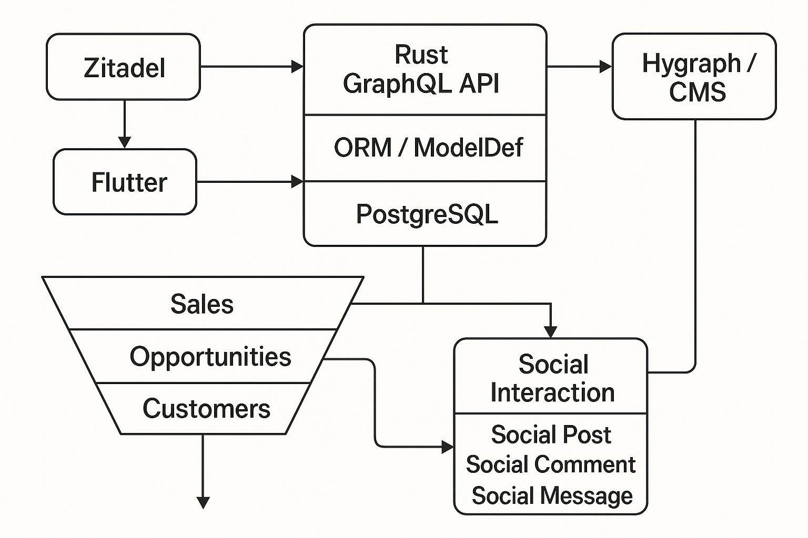
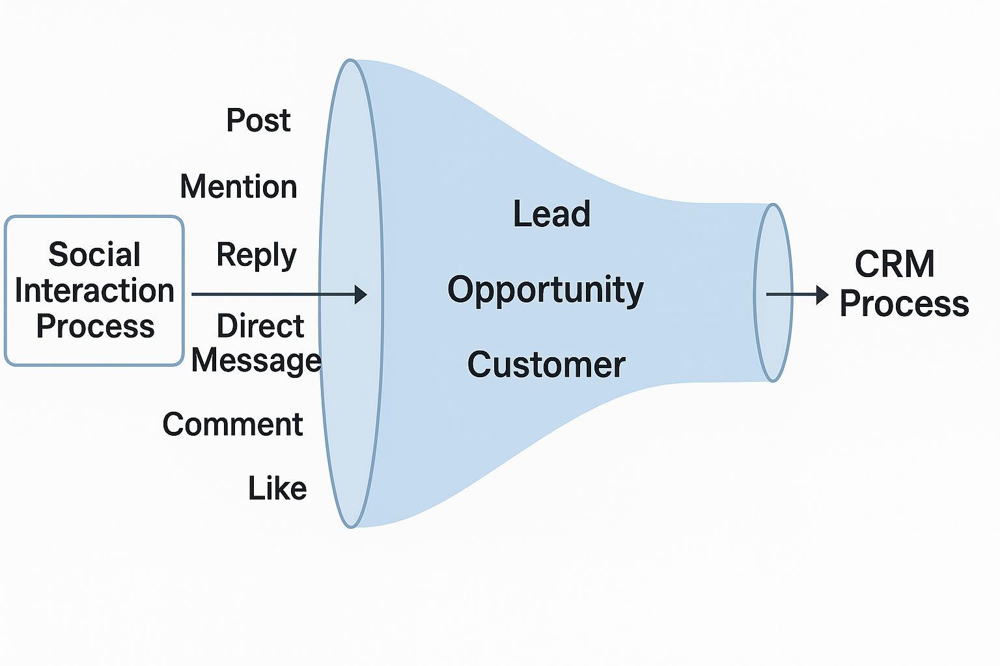
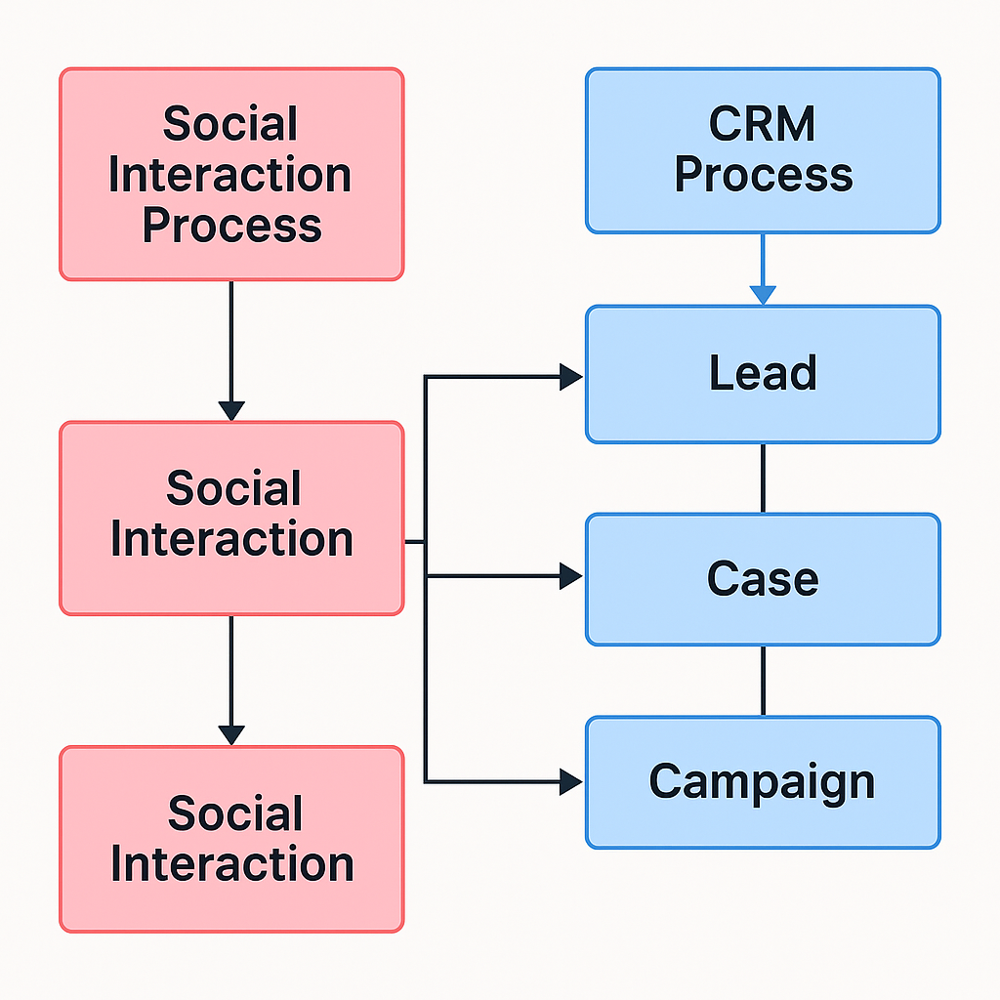

# Diagrams

## Onboarding Architecture

## Social Funnel

## Simple Social/CRM Mapping

These diagrams help new developers understand:

- How ZITADEL, Flutter, Rust API, ORM and PostgreSQL interact.
- How social events flow into the CRM funnel.
- How the metadata-driven approach makes CRM and social models consistent.

See also the textual ERD specification in [ERD.md](ERD.md).
