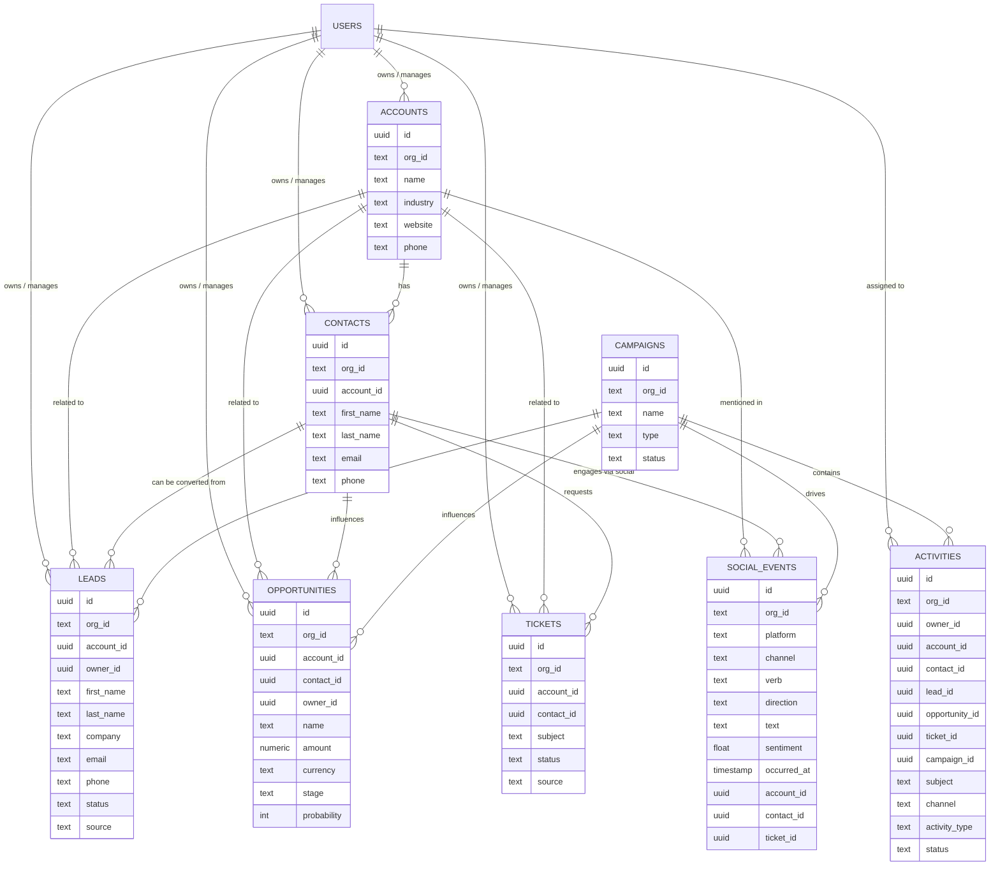

# Entity Relationship Diagram (Core CRM + Social)

The diagram below shows the **core ER model** for the CRM and social
modules, inspired by vtiger but adapted to the metadata-driven design.

> Note: This ERD focuses on **core CRM entities** (Accounts, Contacts,
> Leads, Opportunities, Tickets, Campaigns, Activities) plus
> **SocialEvents**, not every vtiger table. It is meant as a clean,
> vtiger-inspired starting point for the new Rust + GraphQL platform.
